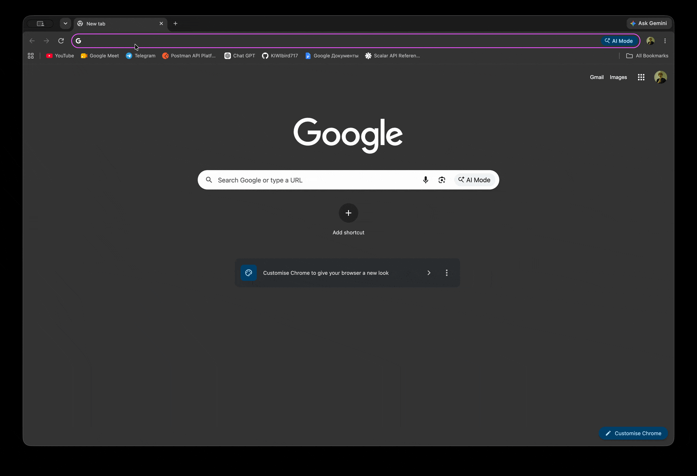

# Fedora Meetings

Браузерные видеовстречи для небольших групп. Хост создаёт комнату, делится ссылкой, и к звонку подключаются до четырёх человек с камерой, микрофоном и чатом. Медиа идёт peer-to-peer через WebRTC mesh. NestJS API использует Socket.IO для signaling, списка участников и чата и хранит состояние комнат в памяти — базы данных нет. Интерфейс приложения на русском.

## Demo



## Возможности

- Создание комнаты и вход по ссылке
- До 4 участников в комнате
- Видео и аудио через WebRTC
- Включение / выключение микрофона и камеры
- Чат и список участников
- Копирование ссылки-приглашения
- Обработка переполнения комнаты и лимита сервиса
- Выход / повторный вход и жизненный цикл отключения
- Ошибки доступа к камере/микрофону и соединения
- Светлая / тёмная тема

## Быстрый старт

```sh
cp .env.example .env && pnpm run compose:up
```

или

```sh
cp .env.example .env && docker compose up --build -d
```

Откройте [http://localhost:8080](http://localhost:8080). nginx отдаёт SPA и проксирует `/api` и `/socket.io` на API.

```sh
pnpm compose:logs    # логи
pnpm compose:down    # остановить
pnpm compose:rebuild # пересобрать образы без кэша
```

Эквивалент: `pnpm compose:up` (нужен `.env`).

### Локальная разработка

- Node.js 22 (Docker-образы используют `node:22-alpine`)
- pnpm 12.4.2 (`packageManager` в `package.json`; можно активировать через Corepack)

```sh
corepack enable
pnpm install
```

В двух терминалах:

```sh
pnpm serve:api
pnpm serve:web
```

Откройте [http://localhost:5173](http://localhost:5173). Vite проксирует `/api` и `/socket.io` на API на порту 3000.

### Окружение

API читает `process.env` (файлы `.env` сам не загружает). Локальные значения по умолчанию в `apps/api/src/config/env.ts` соответствуют Vite на `http://localhost:5173`. Docker Compose подставляет `.env` в `${WEB_PORT}`, `${ROOM_CEILING}` и остальные.

Переменные описаны в `.env.example`:

| Переменная              | Назначение                                                |
| ----------------------- | --------------------------------------------------------- |
| `API_HOST` / `API_PORT` | адрес привязки API (по умолчанию `0.0.0.0:3000`)          |
| `WEB_PORT`              | опубликованный порт nginx в Compose (по умолчанию `8080`) |
| `ROOM_CEILING`          | максимум одновременно занятых комнат (по умолчанию `50`)  |
| `STUN_URLS`             | STUN URL через запятую, отдаются в ack `room:join`        |
| `CORS_ORIGINS`          | разрешённые origin браузера                               |
| `LOG_LEVEL`             | уровень логов Nest                                        |

## Стек

**Монорепозиторий / сборка:** Nx 23, pnpm, TypeScript, Webpack (API), Vite (web)

**Backend:** NestJS, Socket.IO, Zod, nanoid

**Frontend:** React 19, TanStack Router, TanStack Query, Feature-Sliced Design

**Realtime / WebRTC:** Socket.IO signaling, RTCPeerConnection mesh, публичный STUN (без TURN)

**API / контракты:** OpenAPI 3.1, Scalar, openapi-typescript, Zod-схемы событий

**Стили / UI:** Tailwind CSS 4, Radix UI, lucide-react, Inter

**Тесты:** Vitest, Testing Library, Playwright, SuperTest, socket.io-client

**Инфраструктура:** Docker, Docker Compose, nginx (reverse proxy в web-образе)

## Архитектура

Nx-воркспейс: запускаемые приложения в `apps/`, общие библиотеки в `libs/`.

API построен по DDD и гексагональной архитектуре:

- **Domain** (`api-domain`) — инварианты комнаты, участника, чата и media-state
- **Application** (`api-application`) — use cases и порты (`RoomRegistry`, `RoomEventPublisher`)
- **Infrastructure** (`api-infra-memory`) — in-memory реестр комнат
- **Presentation** (`apps/api`) — HTTP-контроллеры и Socket.IO-шлюзы

Веб-приложение следует Feature-Sliced Design (`app`, `pages`, `widgets`, `features`, `entities`, `shared`). Socket.IO находится в `web-realtime`. Захват локальной камеры и микрофона — в `web-media`. WebRTC mesh (`MeshCallSession`) живёт в `web-webrtc` за `SignalingPort`; React только запускает сессию и останавливает её.

HTTP-контракты — OpenAPI (`contracts-http`). Realtime-события и ack — Zod-схемы (`contracts-realtime`). Нет базы данных, auth, Redis и TURN-сервера.

```text
Браузер
  │
  ├── React / FSD (apps/web)
  │     ├── Meeting UI
  │     ├── web-realtime (Socket.IO client)
  │     ├── web-media (getUserMedia)
  │     └── web-webrtc (mesh / RTCPeerConnection)
  │
  │ HTTP + Socket.IO  (/api, /socket.io)
  ▼
NestJS API (apps/api)
  ├── Presentation     HTTP + Socket.IO gateways
  ├── Application      use cases + ports
  ├── Domain           room aggregate
  └── Infrastructure   api-infra-memory
          │
          └── In-memory реестр комнат
```

## Структура проекта

```text
apps/
  api/                 NestJS presentation (HTTP, Socket.IO)
  web/                 React SPA (FSD)
  web-e2e/             Playwright-сценарии

libs/
  api/domain/          доменная модель
  api/application/     use cases и порты
  api/infra-memory/    in-memory RoomRegistry
  contracts/http/      OpenAPI-документ
  contracts/realtime/  Socket.IO-события, DTO, Zod-схемы
  web/ui/              общие UI-примитивы и токены
  web/media/           захват локальных медиа
  web/realtime/        Socket.IO-клиент комнаты и signaling-адаптер
  web/webrtc/          MeshCallSession, PeerLink
```

## Разработка

```sh
pnpm nx run-many -t lint
pnpm nx run-many -t typecheck
pnpm test
pnpm e2e
pnpm nx run-many -t build
pnpm compose:up
```

Примеры по проектам: `pnpm nx lint api`, `pnpm nx test web`, `pnpm nx e2e web-e2e`, `pnpm nx docker:build api`.

## API / документация

Пока API запущен, Scalar отдаёт закоммиченный OpenAPI-документ на `/api/docs` (например [http://localhost:3000/api/docs](http://localhost:3000/api/docs)). Источник: `libs/contracts/http/src/openapi.yaml`.

HTTP ограничен health (`GET /api/health`) и выдачей id комнаты (`POST /api/rooms`). Вход, выход, чат, media state и WebRTC signaling — события Socket.IO из `contracts-realtime`.

## Тесты

**Unit / integration (Vitest):** правила домена и application, in-memory реестр, хелперы WebRTC mesh и локальных медиа, React-компоненты, HTTP/Socket.IO-тесты Nest (SuperTest + socket.io-client).

**E2E (Playwright, `web-e2e`):** создание комнаты, вход по ссылке, чат, переключение микрофона/камеры, выход, отказ пятому участнику, XSS-отрисовка имени и чата, цветовая схема.

E2E идёт только в Chromium с фейковыми камерой и микрофоном, чтобы медиа-сценарии не требовали железа. Firefox/WebKit не настроены: их флаги fake-device не эквивалентны.

## Архитектурные решения

- **Комнаты in-memory.** Занятые комнаты — единственное серверное состояние. Пустые комнаты удаляются. Персистентность была вне скоупа.
- **WebRTC mesh.** Четыре участника — не больше трёх peer-соединений на клиента. Нет SFU и медиасервера.
- **Socket.IO для signaling и realtime.** Вход/выход, roster, чат, media-state и релей SDP/ICE идут по одному транспорту. Само медиа через сервер не проходит.
- **WebRTC вне React.** `MeshCallSession` общается через `SignalingPort`. UI не создаёт `RTCPeerConnection`.
- **Нет базы данных, auth, Redis и TURN.** Клиентам отдаются STUN URL; обход NAT сверх STUN не предусмотрен.

## Лицензия

ISC (`package.json`).
