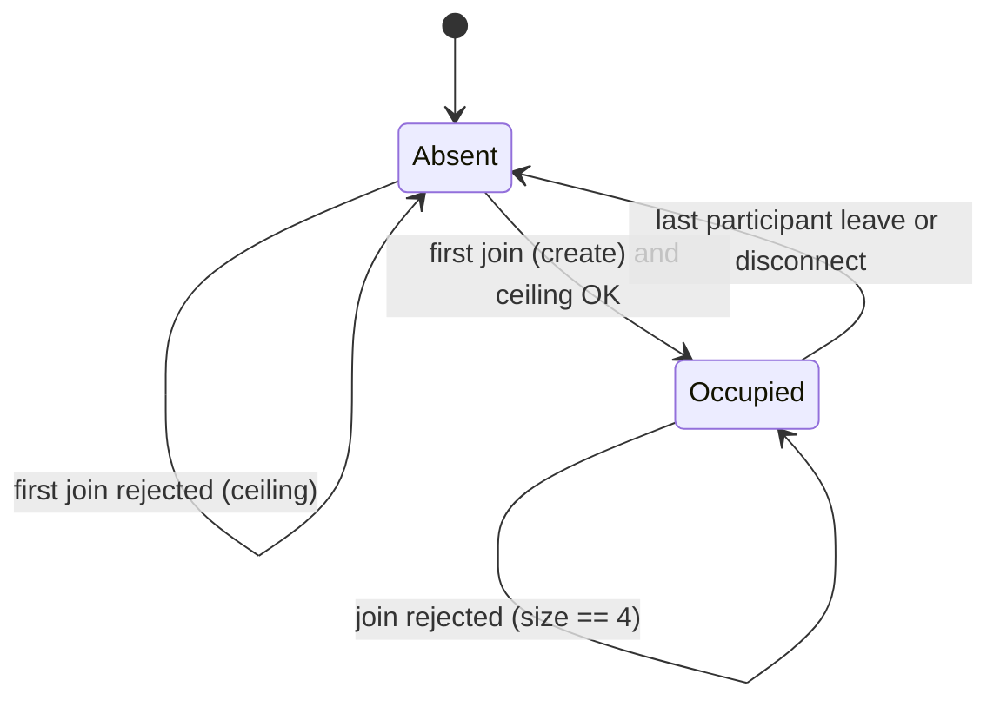
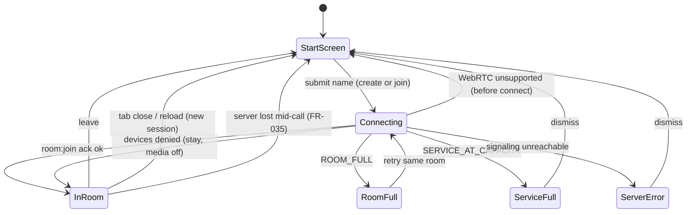
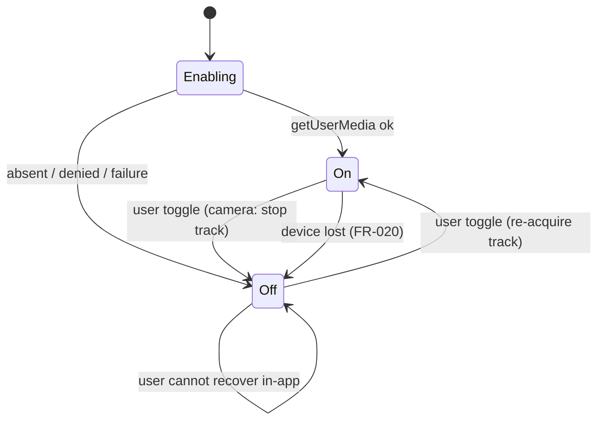
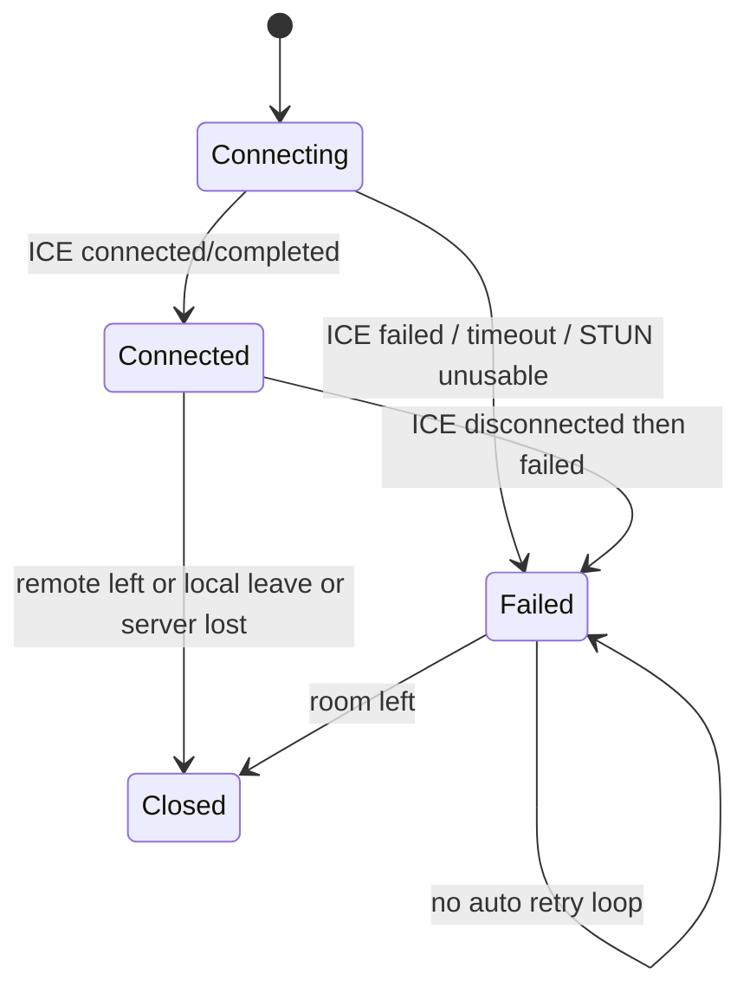

# Data Model: Video Chat Room

**Feature**: `001-video-chat-room`  
**Storage**: process memory only. No database, no ORM, no persistent volume.

Room, participant and chat state die with the room (FR-009, NFR-006). Nothing is stored on the client between reloads (NFR-005).

## Identifiers

| Type | Format | Visibility |
|------|--------|------------|
| `RoomId` | 8–32 chars `A-Za-z0-9_-` (minted as 12-char nanoid) | In the URL; only access token; **not** a secret |
| `ParticipantId` | UUID v4 | Hidden from UI (FR-030). Used in socket payloads and WebRTC signaling |
| `ChatMessageId` | UUID v4 | Internal (list keys); not shown |
| `SocketId` | Socket.IO id | **Infrastructure only.** Never in domain or DTOs |

## Entities and value objects

### Room (aggregate root)

Consistency boundary for membership, chat history, and lifecycle.

| Field | Type | Rules |
|-------|------|--------|
| `id` | `RoomId` | Immutable. Identity. |
| `participants` | `Participant[]` | 1–4 while the aggregate exists. Empty room is deleted, not stored. |
| `messages` | `ChatMessage[]` | Participant-authored only. Unbounded except FR-040 and room lifetime. |
| `createdAt` | `Date` | Set on first successful join. |

**Invariants** (enforced on the aggregate, not in controllers):

- `participants.length` is in `1..4`.
- No two participants share `ParticipantId`.
- Display names may collide.
- System join/leave events are **not** stored on the aggregate.
- When the last participant is removed, the aggregate is deleted from the registry.

**Commands**: `addParticipant`, `removeParticipant`, `appendMessage`.

### Participant (entity inside Room)

| Field | Type | Rules |
|-------|------|--------|
| `id` | `ParticipantId` | UUID, hidden |
| `displayName` | `DisplayName` | See value object |
| `media` | `MediaState` | Mic/camera booleans as known to the room |
| `joinedAt` | `Date` | |
| `recentChatSentAt` | `Date[]` | Application-owned sliding window for FR-040; not serialized to clients |

Two browser tabs = two participants (FR-029). No role/privilege field (FR-032).

### DisplayName (value object)

- Trimmed.
- Length 1–30 (truncate **before** accept on the client as UX; server **rejects** names longer than 30 rather than silently storing 31+. Spec US-1 says “not accepted in that form — truncated to 30”: **client truncates input**; server max is 30).
- Pattern: Unicode letters, digits, space, hyphen, apostrophe: `^[\p{L}\p{N} \-']+$`
- Reject empty/whitespace.
- Not unique.
- XSS is handled at **render** (FR-039), not by mutating the stored string beyond validation.

### MediaState (value object)

| Field | Type | Meaning |
|-------|------|---------|
| `microphoneEnabled` | `boolean` | Audio is being transmitted |
| `cameraEnabled` | `boolean` | Video track is acquired and transmitted |

Client-only reasons (`absent`, `denied`, `lost`) affect local UX and initial values; the room broadcasts the two booleans. Tiles use: camera off → silhouette; mic off → struck-through mic icon (FR-016, FR-018).

### ChatMessage (entity)

| Field | Type | Rules |
|-------|------|--------|
| `id` | `ChatMessageId` | |
| `authorId` | `ParticipantId` | Hidden in UI |
| `authorName` | `string` | Snapshot of display name at send time |
| `text` | `ChatText` | See value object |
| `sentAt` | `Date` | Stored UTC; rendered `HH:MM` in **viewer** local time (FR-022, A-007) |

### ChatText (value object)

- Trimmed; empty/whitespace rejected (FR-024).
- Max 1000 characters (FR-040).
- Stored as received after trim; **not** HTML-sanitized on the server (escaping is a render concern, FR-039).

### SystemEvent (not persisted)

Emitted live only (FR-023, FR-025).

| Field | Type |
|-------|------|
| `kind` | `'joined' \| 'left'` |
| `participantId` | `ParticipantId` |
| `displayName` | `string` |
| `occurredAt` | `Date` |

Wording must **not** use «соединение потеряно» (FR-031). Same “left” copy for explicit leave, tab close, and disconnect.

### InviteLink

Not stored. Derived as the current page URL (`origin + /room/{roomId}`).

## Registry (infrastructure, behind a port)

`RoomRegistry` (in-memory `Map<RoomId, Room>`):

- `mintRoomId(): RoomId` — unique among **active** ids; does not insert.
- `tryJoin(input): JoinResult` — atomic create-or-join.
- `leave(roomId, participantId): LeaveResult`
- `get(roomId): Room | undefined`
- `activeRoomCount(): number`

Global invariant: `activeRoomCount() <= ROOM_CEILING`.

## Validation rules (single definition, three uses)

| Rule | Domain | Boundary (Zod) | Client UX |
|------|--------|----------------|-----------|
| Display name charset/length | `DisplayName` construction | join payload / HTTP if any | inline hint |
| Chat empty/length | `ChatText` | `chat:send` | disable send + hint |
| 10 messages / 10 s | application precondition using `recentChatSentAt` | same ack error | hint, do not drop silently |
| Room size 4 | `Room.addParticipant` | — | «Комната заполнена» |
| Room ceiling | registry insert | POST pre-check + join | service-at-capacity message |

Do not reimplement the regex in three different literals; export constants from the domain (or a tiny `libs/api/domain` constants module). Zod may import those constants. Domain MUST NOT import Zod.

## State transitions

### Room lifecycle

`Absent` means no map entry. Reusing the same `RoomId` after deletion is a **new** empty room (FR-005, FR-009).

### Participant session (client)

Reload always returns to name entry (NFR-005). No automatic reconnect.

### Media per participant

Microphone default on; camera default on (FR-013). Off camera **stops** the video track (FR-019).

### Peer link (one remote participant)

`Failed` is the per-tile error state (FR-034). It MUST NOT look like infinite loading.

## Mapping to transport

Domain objects are **never** serialized directly.

| Direction | Mapping |
|-----------|---------|
| Socket join ack | Room + self id → `JoinedDto` (participants without internals except id, chat history without system events) |
| Chat broadcast | `ChatMessage` → `ChatMessageDto` (`sentAt` ISO-8601) |
| System event | constructed in application → `SystemEventDto` |
| HTTP mint | `RoomId` → `{ roomId }` |

Frontend displays `sentAt` with `Intl`/`Date` in local `HH:MM`.
