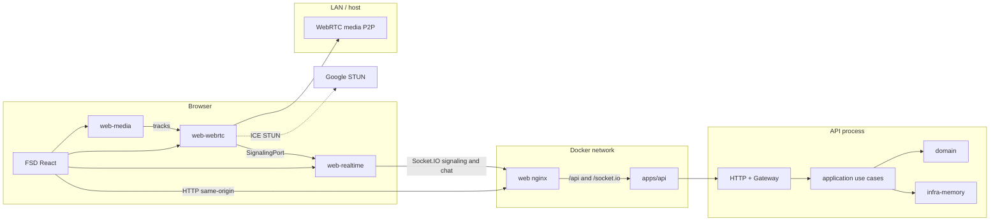
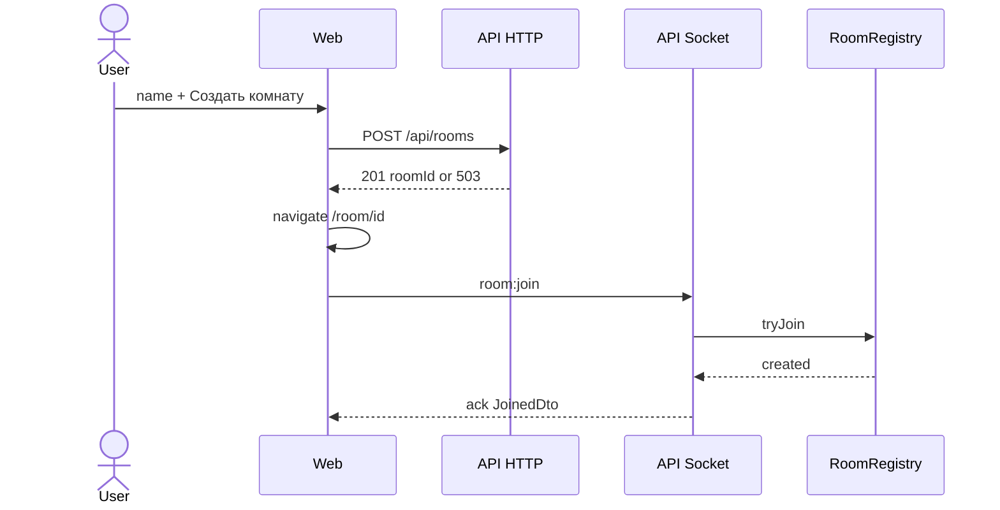

# Implementation Plan: Video Chat Room

**Branch**: `main` (feature id `001-video-chat-room` via `.specify/feature.json`; Spec Kit git extension is not installed) | **Date**: 2026-09-19 | **Spec**: [`spec.md`](./spec.md)

**Input**: Feature specification from `/specs/001-video-chat-room/spec.md`

**TDD role**: This file plus `research.md`, `data-model.md`, `contracts/` and `quickstart.md` **are** the approved technical design. They are not duplicated under `prds/` (see research CFL-005). `docs/prd.md` remains authoritative for product behaviour; `.specify/memory/constitution.md` v1.1.0 is authoritative for architecture.

**Note**: This template is filled in by the `/speckit-plan` command; its definition describes the execution workflow.

## Summary

Build a no-registration 4-person video room with shared chat: mint or open a room by URL, join with a display name, mesh WebRTC for media, Socket.IO for signaling/chat/roster, in-memory server state, Russian desktop UI.

Technical approach: package-based Nx 23 monorepo (`apps/api`, `apps/web`) with hexagonal NestJS (domain/application libraries + in-memory adapter), FSD React/Vite client, WebRTC isolated behind `libs/web/webrtc`, same-origin Docker Compose (nginx + api) that does **not** carry media. No database, auth, Redis, TURN, or extra services.

## Technical Context

**Language/Version**: TypeScript 5.x strict, Node.js 22 LTS, ESM, pnpm 12.4.2, Nx 23.2.1

**Primary Dependencies**:

- Backend: NestJS (Express), Socket.IO 4, Zod, `@nestjs/swagger` + `@scalar/nestjs-api-reference`, `nanoid`
- Frontend: React 19, Vite, TanStack Router, TanStack Query, Socket.IO client, `openapi-typescript`, Tailwind CSS, shadcn/ui (source), Lucide React, Inter (self-hosted)
- Tooling: ESLint + `@nx/enforce-module-boundaries`, Prettier, Vitest, Playwright, `@nx/docker`
- Realtime media: native WebRTC (`RTCPeerConnection`), Google STUN only

**Storage**: In-memory `Map` behind `RoomRegistry` port. No database, no volumes.

**Testing**: Vitest (unit + Nest/socket integration), Playwright (`apps/web-e2e`)

**Target Platform**: Desktop browsers Chrome / Firefox / Edge 100+; viewport ≥ 1024px; secure context (HTTPS or localhost)

**Project Type**: Nx web application (SPA + Nest API) in a pnpm monorepo, deployable with Docker Compose

**Performance Goals**: Media delay ≤ 500 ms on LAN (NFR-001); chat visible ≤ 1 s on LAN (SC-005); tile removal ≤ 5 s on leave/disconnect (SC-007); first join < 30 s (SC-001)

**Constraints**: Max 4 participants/room (mesh); configurable `ROOM_CEILING` (default 50); no persistence; no auth; no TURN; no auto-reconnect; Socket.IO client `reconnection: false`; Russian UI only; constitution layering and Nx tags

**Scale/Scope**: One SPA, one API process, 2 routes, 13 user stories, ~12 Nx projects (2 apps + e2e + libs below). Demo-scale concurrent rooms.

## Constitution Check

*GATE: Must pass before Phase 0 research. Re-check after Phase 1 design.*

| Gate | Pre-design | Post-design |
|------|------------|-------------|
| I Nx apps/libs, tags, public entry points, no catch-all `shared`, no deep imports | PASS (planned greenfield structure) | PASS |
| II Deps inward; domain free of Nest/Socket/Zod/HTTP/env | PASS | PASS |
| III Pragmatic DDD (`Room` aggregate, VOs, named errors; no generic `BaseEntity`) | PASS | PASS |
| IV Ports/adapters; DI only at composition | PASS | PASS |
| V Use cases own orchestration; thin gateways/controllers | PASS | PASS |
| VI Zod at boundaries only; env validated at startup | PASS | PASS |
| VII OpenAPI + Scalar; `openapi-typescript`; shared realtime contract lib | PASS | PASS |
| VIII Socket.IO is transport; one state owner; atomic 4-cap; WebRTC isolated | PASS | PASS |
| IX FSD; smallest state scope; no Zustand | PASS | PASS |
| X Strict TypeScript | PASS | PASS |
| XI Categorized errors, mapped at adapters, PRD failure copy | PASS | PASS |
| XII No unspecified product features; no DB/auth/Redis/TURN/SFU | PASS | PASS |
| XIII–XVI Tailwind tokens, variants, a11y, desktop ≥1024 (mobile-first authoring only) | PASS | PASS |
| No persistence / no authentication | PASS | PASS |

**Justified stack additions** (not MUST violations): Docker Compose, shadcn/ui, Lucide — see Complexity Tracking and research CFL-006.

**Complexity that looks like extra architecture but is required**: hexagonal libs, WebRTC/media/realtime isolation, in-memory port — constitution I, IV, VIII, not speculation.

## Project Structure

### Documentation (this feature)

```text
specs/001-video-chat-room/
├── plan.md              # This file (/speckit-plan command output)
├── research.md          # Phase 0 output
├── data-model.md        # Phase 1 output
├── quickstart.md        # Phase 1 output
├── contracts/
│   ├── openapi.yaml
│   └── realtime.md
└── tasks.md             # Phase 2 output (/speckit-tasks — not created here)
```

### Source Code (repository root)

Planned. **Does not exist yet.** Implementation must create this; planning does not.

```text
apps/
├── api/                         # Nest composition root: main.ts, AppModule, HTTP controllers, Socket.IO gateway, config
├── web/                         # Vite + React SPA (FSD folders inside src/)
│   └── src/
│       ├── app/                 # providers, router, styles.css (tokens), entry
│       ├── pages/               # start, room
│       ├── widgets/             # video-grid, control-bar, chat-panel, participant-list
│       ├── features/            # enter-room, copy-invite, toggle-media, send-message, leave-room, meeting-session
│       ├── entities/            # room, participant, chat-message (view models)
│       └── shared/              # app-local helpers only; UI primitives come from @fedora-meetings/web-ui
└── web-e2e/                     # Playwright

libs/
├── api/
│   ├── domain/                  # Room, Participant, VOs, domain errors, ports owned by domain
│   ├── application/             # use cases + application ports
│   └── infra-memory/            # RoomRegistry in-memory adapter
├── contracts/
│   ├── http/                    # committed OpenAPI source; generate script for web types
│   └── realtime/                # event names, DTO types, Zod payloads
└── web/
    ├── ui/                      # shadcn primitives, tokens, cn(), lucide re-export policy
    ├── media/                   # getUserMedia, track acquire/release
    ├── webrtc/                  # MeshCallSession, PeerLink — no React, no Socket.IO
    └── realtime/                # Socket.IO client implementing SignalingPort + room commands

docker-compose.yml               # created at implement, not now
.env.example
.dockerignore
apps/api/Dockerfile
apps/web/Dockerfile
```

**Nx tags**

| Project | Tags |
|---------|------|
| `api` | `scope:api`, `type:app` |
| `web` | `scope:web`, `type:app` |
| `web-e2e` | `scope:web`, `type:e2e` |
| `api-domain` | `scope:api`, `type:domain` |
| `api-application` | `scope:api`, `type:application` |
| `api-infra-memory` | `scope:api`, `type:infra` |
| `contracts-http` | `scope:shared`, `type:contracts` |
| `contracts-realtime` | `scope:shared`, `type:contracts` |
| `web-ui` | `scope:web`, `type:ui` |
| `web-media` | `scope:web`, `type:infra` |
| `web-webrtc` | `scope:web`, `type:infra` |
| `web-realtime` | `scope:web`, `type:infra` |

**Dependency constraints** (ESLint `enforce-module-boundaries` + dep-constraints):

- `type:domain` → no `type:app|application|infra|ui`, no npm `nestjs`, `socket.io`, `zod`
- `type:application` → `type:domain` only (plus test fakes)
- `type:infra` (api) → `type:application`, `type:domain`
- `scope:api` apps → application, infra-memory, contracts, not `scope:web` except contracts
- `scope:web` → contracts, `web-ui`/`web-media`/`web-webrtc`/`web-realtime`; **pages/widgets/features MUST NOT import** `RTCPeerConnection`, `io(` internals, or `socket.io` except through `web-realtime` / `web-webrtc` public APIs
- `type:ui` → no features/entities/pages
- No circular deps; no deep imports

**Structure Decision**: Constitution-mandated `apps/web` + `apps/api` with purpose-split libraries. FSD lives inside the web app. Presentation adapters stay in `apps/api` (single composition root). Package names `@fedora-meetings/*`. Root package renamed to `fedora-meetings`. `pnpm-workspace.yaml` gains `packages: ['apps/*', 'libs/**']`.

## Complexity Tracking

| Violation | Why Needed | Simpler Alternative Rejected Because |
|-----------|------------|-------------------------------------|
| Docker + Compose not on constitution fixed stack | User-mandated local deployment; does not change product architecture | Skipping containers fails the requested run/rebuild/logs workflow |
| shadcn/ui + CVA + Radix primitives | Mandated UI system; Tailwind source components, not CSS-in-JS | Hand-rolled primitives duplicate a11y and violate “prefer shadcn” |
| Lucide React not on fixed stack | Single icon library for icon-only controls (WCAG name + spec mic icon) | Emoji or a second icon pack are forbidden |
| ~10 libraries | Principles I, VIII (isolate WebRTC/realtime/UI kit/contracts/domain) | One `shared` lib is forbidden; stuffing WebRTC into React is forbidden |

---

## Current architecture & codebase summary

Greenfield. Files that matter today:

| Path | Role |
|------|------|
| `package.json` | Nx + pnpm stub; rename needed |
| `nx.json` | Cloud id only |
| `pnpm-workspace.yaml` | Incomplete (no packages) |
| `.gitignore` | Already safe for `.env` |
| `docs/prd.md` | Product source |
| `specs/001-video-chat-room/spec.md` | Feature spec |
| `.specify/memory/constitution.md` | Architecture source |

No controllers, services, schemas, or tests to extend.

## Proposed architecture



WebRTC media never enters the API or nginx except as signaling JSON (SDP/ICE).

### Backend layers

**Domain** (`libs/api/domain`): `Room` aggregate, `Participant`, `DisplayName`, `ChatText`, `MediaState`, `RoomId`/`ParticipantId` branded strings, named errors (`RoomFullError`, `ServiceAtCapacityError`, `InvalidDisplayNameError`, `InvalidChatTextError`). Ports: none required beyond what application declares, except domain may declare `Clock` if tests need it — otherwise use cases pass `Date`.

**Application** (`libs/api/application`): use cases, one operation each:

- `MintRoomId`
- `JoinRoom`
- `LeaveRoom`
- `SendChatMessage`
- `UpdateMediaState`
- `RelaySignal` (pass-through after membership check — no SDP logic)

Port `RoomRegistry`. Join/leave must call registry methods that mutate synchronously. `RelaySignal` loads membership then calls `SignalRelay` port implemented by the gateway/broadcaster — still no WebRTC in application.

**Infrastructure**: `InMemoryRoomRegistry` — `Map` + `activeRoomCount`; `tryJoin` / `leave` critical sections without yielding.

**Presentation** (`apps/api`):

- `RoomsController` → `MintRoomId`
- `HealthController`
- `RoomsGateway` → use cases; maps `socket.id` ↔ `participantId`; on `disconnect` → `LeaveRoom`
- Zod pipes / gateway filters
- Global exception filter → `ErrorResponse`
- OpenAPI document + Scalar at `/api/docs`
- ConfigModule: Zod `process.env` once

### Frontend FSD

| Layer | Contents |
|-------|----------|
| `app` | QueryClient, Router, socket factory, CSS variables, `TooltipProvider` |
| `pages` | Start (name + create), Room (grid + chrome) |
| `widgets` | `VideoGrid`, `SelfView`, `RemoteTile`, `ControlBar`, `ChatPanel`, `ParticipantList` |
| `features` | `enter-room`, `copy-invite-link`, `toggle-microphone`, `toggle-camera`, `send-chat`, `leave-room`, `meeting-session` (store + wiring) |
| `entities` | participant tile view-model, chat message view-model |
| `shared` | nothing that belongs in `web-ui` |

`meeting-session` holds: connection state union, roster, messages, system events, per-peer media connection state. It calls `web-realtime` and `web-webrtc` APIs. JSX does not create peer connections.

Routes (TanStack Router, code-based):

- `/` start
- `/room/$roomId` name gate if session empty, else room

No `localStorage`. Name lives in session memory only.

### WebRTC architecture

`MeshCallSession`:

- `attachLocal(stream)` / `clearVideoTrack()` / `setMicrophoneEnabled(boolean)`
- `addPeer(participantId)` / `removePeer(participantId)` / `dispose()`
- Events: `onRemoteStream`, `onPeerState` (`connecting | connected | failed | closed`)

`PeerLink`: one `RTCPeerConnection`. Existing peers **offer** to the newcomer. ICE servers from config. `iceConnectionState` `failed` or `disconnected` past a short bounded wait → `failed` (FR-034). Camera off: `stop()` video track and `replaceTrack(null)` then re-acquire on enable (FR-019). No TURN. STUN list from env, default Google.

`SignalingPort` in `web-webrtc` (interface only). Implemented in `web-realtime`. React never implements it.

### Socket.IO signaling architecture

Gateway is a translator:

1. Validate payload (Zod)
2. Resolve participant from socket map
3. Call use case
4. Ack result or broadcast DTO

Broadcasts go to Socket.IO room `room:{roomId}` after join. Signaling messages are **unicast** to the target socket. Server does not store SDP.

Client: single socket, `reconnection: false`. Connect error or later disconnect while `InRoom` → FR-035 teardown (dispose mesh, release media, navigate to `/`, show server error).

### Room and participant state management

**One owner**: `InMemoryRoomRegistry` inside the API process.

Client roster is a projection of join ack + `participant-joined` / `participant-left`. Chat list = join `messages` + `chat:message`; system lines appended from `chat:system` only (not replayed).

Capacity:

- 4-person check inside `Room.addParticipant`
- Ceiling check inside registry insert
- Both in the same synchronous `tryJoin`

---

## API contracts

See [`contracts/openapi.yaml`](./contracts/openapi.yaml) and [`contracts/realtime.md`](./contracts/realtime.md).

HTTP (prefix `/api`): `GET /health`, `POST /rooms`. Scalar `/api/docs`. Generated TS in web via `openapi-typescript` as an Nx target `contracts-http:generate` consumed by `web`.

Socket commands: `room:join`, `room:leave`, `chat:send`, `media:state`, `signal:offer|answer|ice-candidate` with acks. Pushes listed in the realtime contract.

## Data models

See [`data-model.md`](./data-model.md). No DB changes. No migrations.

## Data and control flows

### Create room



### Join existing / missing id (FR-005)

Same `room:join`. If id unknown → create (ceiling). If known → add (4-cap). No HTTP “get room”.

### Chat

Client `chat:send` → validate → append on aggregate → broadcast `chat:message`. Rate limit via participant sliding window. Late joiner receives `messages` in join ack only.

### Media toggle

Local `web-media` mutates tracks → `web-webrtc` replaceTrack → `media:state` to server → broadcast for icons. Camera off must `stop()` the track.

### Peer leave / disconnect

`disconnect` or `room:leave` → `LeaveRoom` → remove peer, maybe delete room → `participant-left` + `chat:system` kind `left`. Remaining mesh sessions `removePeer`.

---

## Error handling and edge cases

| Condition | Mapping |
|-----------|---------|
| Empty/bad name | Client hint; server `VALIDATION_ERROR` |
| Room full | ack `ROOM_FULL` + «Комната заполнена» + retry same id |
| Ceiling on create | HTTP 503 and/or join ack `SERVICE_AT_CAPACITY` |
| Empty/too long/flood chat | no send / ack `VALIDATION_ERROR` or `RATE_LIMITED` with hint |
| XSS | React text nodes; no `dangerouslySetInnerHTML` |
| Devices denied/absent | stay in room; toast/alert; media flags false |
| Device lost mid-call | local track ended → Off; no in-app device picker |
| STUN/NAT pair fail | tile `PEER_MEDIA_FAILED`; room continues |
| Signaling down at entry | `SERVER_UNREACHABLE` on start |
| Signaling down in call | teardown + start + same message; no reconnect |
| No WebRTC | block before join |
| Autoplay | entry click is the gesture; fallback «Включить звук» |
| Two tabs | two slots |
| Reload | new participant; name again |
| Last leave | registry delete; history gone |

Unexpected errors: log server-side, client `INTERNAL_ERROR` generic copy. Never swallow.

---

## Testing strategy

| Layer | Where | What |
|-------|-------|------|
| Unit domain | `api-domain` | name/chat VOs, 4-cap, last-leave deletes, duplicate names, system events not stored |
| Unit application | `api-application` | use cases with fake registry; race-free join via fake that records call order |
| Unit webrtc/media | libs with mocked `RTCPeerConnection` | add/remove peer, camera stop, dispose |
| Integration | `apps/api` | supertest health/mint; two `socket.io-client`s: join, full, ceiling, chat, leave, disconnect |
| Component | `web` | name validation, room-full view, tile states (icon not color-only) |
| E2E | `web-e2e` | journeys in constitution: create, join link, 5th rejected, chat, toggles, leave |
| Contract | generate OpenAPI types in CI; `tsc` fails on drift |

Deterministic: wait for socket acks / roles, not `setTimeout`. Playwright fake devices. LAN 500 ms delay is **manual/NFR**, not a flaky automated gate.

---

## Dependency choices

**Add**: NestJS stack, Socket.IO, Zod, Scalar, nanoid, React, Vite, TanStack Router/Query, Tailwind, shadcn toolchain (`class-variance-authority`, `clsx`, `tailwind-merge`, Radix as pulled by used components), lucide-react, @fontsource-variable/inter, openapi-typescript, Vitest, Playwright, `@nx/docker`.

**Do not add**: Prisma/Drizzle, Passport, Redis, Kafka, LiveKit, simple-peer, Zustand, Redux, styled-components, Emotion, CSS Modules, i18n, Heroicons, Font Awesome, TURN (coturn), extra Compose services.

**Verify before add** (constitution): maintenance, bundle cost, no duplicate problem-solvers. shadcn components added **as used**, not the full catalog.

---

## Security considerations

- No authentication by design (FR-006). Room id is guessable; treat as a shared link, not a capability-security system.
- All inputs Zod-validated. Length limits server-side.
- XSS: validate + text rendering. Allowlist is not a substitute for escaping (FR-038).
- No secrets in repo, Dockerfiles, or Compose. This app currently needs none.
- Non-root containers. Least privilege defaults.
- Do not expose stack traces. Do not put `socket.id` on the client.
- CORS: local Vite origin allowlist from env; Docker same-origin so CORS can be tight.
- Helmet/rate-limit-by-IP: **not** required (clarification: no per-client rate limit except chat FR-040).
- DTLS-SRTP is default WebRTC; no extra E2E layer (non-goal).
- `ROOM_CEILING` bounds unauthenticated memory.

---

## Performance considerations

Correct defaults only (Principle XII):

- Max 6 P2P links per room; do not renegotiate unless tracks change
- Remove listeners, tracks, PCs, socket handlers on dispose
- Chat window auto-scroll without re-rendering the whole meeting store unsafely
- No bitrate cap (non-goal)
- Bound `recentChatSentAt` array to 10
- Ceiling 50 rooms × 4 × chat in RAM — acceptable for the spec; do not add LRU eviction of **occupied** rooms
- Nginx static assets, gzip; API is light (signaling)

---

## Frontend UI / design system

- shadcn/ui source in `libs/web/ui` (Button, Input, Textarea, Card, Tooltip, Avatar, Badge, Separator, ScrollArea, Alert, Sonner/toast). Add Dialog only if room-full needs it; semantic HTML otherwise.
- Tailwind utilities + semantic tokens: `background`, `foreground`, `card`, `popover`, `primary`, `secondary`, `muted`, `accent`, `destructive`, `border`, `input`, `ring`.
- Light theme default. Structure `:root` and `.dark` token slots; **do not ship dark mode**.
- Primary accent: one restrained blue (primary token). Neutral zinc/slate surfaces. No glassmorphism, heavy shadows, or decorative gradients.
- Meeting layout: video first; controls bar obvious; chat/roster secondary column from 1024px.
- Destructive: leave button uses `destructive` variant.
- Icons: Lucide only (`Mic`, `MicOff`, `Video`, `VideoOff`, `PhoneOff`, `Copy`, `Users`, `MessageSquare`). Icon-only buttons: `Tooltip` + `aria-label`.
- Typography: Inter, small scale (heading / body / label / meta). Readable line-height, tokenized sizes.
- a11y: WCAG 2.2 AA as applicable; visible `focus-visible`; mic/camera state via icon + text, not color alone; keyboard-operable controls.

Product copy is Russian only (table in `contracts/realtime.md`).

---

## Docker architecture

**Not created in this planning phase.**

### Image strategy

Both app Dockerfiles: **multi-stage**, context = **repository root**.

**API**

1. `deps`: Node 22 + pnpm, copy lockfile/workspace, `pnpm install --frozen-lockfile`
2. `build`: `pnpm nx build api` (and prune if using Nx prune-lockfile)
3. `runtime`: Node 22 alpine (or distroless-node if it stays practical), copy production install + `dist`, `USER` non-root, `NODE_ENV=production`, `CMD` node the compiled entry. No pnpm/devDependencies.

Prefer Nx prune-lockfile + copy-workspace-modules (Nx 23.2 pnpm support) so the runtime stage is not a full monorepo.

**Web**

1. Same deps/build: `pnpm nx build web` → static `dist`
2. `runtime`: `nginx:alpine` (or unprivileged nginx), copy static files, nginx config: SPA fallback, `location /api/` and `/socket.io/` proxy_pass to `http://api:3000` with websocket upgrade. Non-root. No Node in the final web image.

`@nx/docker` in `nx.json` infers `docker:build` / `docker:run` from those Dockerfiles. Compose still orchestrates the pair.

`.dockerignore`: `node_modules`, `dist`, `.git`, `.nx`, `.env`, `.env.*` except example, coverage, IDE, `tmp`.

### Compose architecture

Services: `api`, `web`. Network: bridge `fedora-meetings`. **No volumes** for app data. Ports: `API_PORT:3000`, `WEB_PORT:80` (or 8080→80). `web` depends on `api` healthy. Healthcheck: `GET /api/health` on api; `wget`/`curl` `/` on web.

Restart policy `unless-stopped` is enough; no orchestrator.

### Dev vs production containerization

- **Local deploy/test**: Compose production-like images (`pnpm compose:up`).
- **Code iteration**: `pnpm nx serve api` + `pnpm nx serve web` (Vite HMR + proxy). Not a second Compose file unless later justified.

### Environment variables

| Variable | Default | Used by |
|----------|---------|---------|
| `NODE_ENV` | `production` in images | api |
| `API_HOST` | `0.0.0.0` | api bind |
| `API_PORT` | `3000` | api, compose |
| `WEB_PORT` | `8080` | compose publish |
| `ROOM_CEILING` | `50` | api |
| `STUN_URLS` | `stun:stun.l.google.com:19302,stun:stun1.l.google.com:19302` | api config → join ack **or** web build; prefer sending STUN list in `RoomJoinResult` so Docker web image is env-agnostic. If kept in web, inject via nginx `env.js` — do **not** hardcode. **Plan: include `iceServers` in join ack** (config, not a secret). |
| `CORS_ORIGINS` | `http://localhost:5173` | api; empty/unused when same-origin |
| `LOG_LEVEL` | `info` | api |

Frontend in Docker uses relative `/api` and `/socket.io`. Local Vite uses proxy; optional `VITE_API_BASE_URL` empty = relative.

`.env.example` lists every variable with comments. No passwords.

**Amendment to join DTO**: `iceServers: { urls: string }[]` on `RoomJoinResult` so STUN is server-configured without rebuilding the SPA. Still not TURN.

### Container networking vs WebRTC

Browser on the host talks to `localhost:WEB_PORT`. Signaling: browser → nginx → `api:3000`. ICE: browser ↔ Google STUN. Media: browser ↔ browser. Docker DNS name `api` is **never** used as a WebRTC URL. Do not set host networking “so WebRTC works”.

### Health checks

- API: `GET /api/health` → `{ status: "ok" }`
- Compose `healthcheck` on api
- Web: HTTP 200 on `/`

### Local commands (to add at implement)

| Intent | Command |
|--------|---------|
| Start full app | `pnpm compose:up` → `docker compose up --build -d` |
| Stop | `pnpm compose:down` |
| Rebuild images | `pnpm compose:rebuild` |
| Logs | `pnpm compose:logs` |
| Tests | `pnpm nx run-many -t test` / `pnpm nx e2e web-e2e` |
| API only | `pnpm nx serve api` or `pnpm nx docker:run api` |
| Web only | `pnpm nx serve web` |
| Image build | `pnpm nx docker:build api` / `web` |

Details in [`quickstart.md`](./quickstart.md).

---

## Risks and mitigations

| Risk | Mitigation |
|------|------------|
| Strict NAT: some pairs fail | Accepted (FR-034); per-tile error, not TURN |
| Google STUN outage | Same per-tile failure; configurable `STUN_URLS` |
| Unauthenticated memory growth | `ROOM_CEILING` + chat rate/length |
| Socket.IO default reconnect | Disable on client |
| Empty room leak via POST | Mint id only |
| Nx Docker + pnpm workspace copy mistakes | Root context, prune-lockfile, `.dockerignore` |
| Playwright + real WebRTC flakiness | Fake devices; assert signaling/UI, not LAN RTT |
| shadcn + FSD boundary drift | primitives only in `web-ui` |
| Scalar ESM vs Nest CJS | Express adapter; pin documented import style during implement |

## Open questions

None blocking. Remaining implementer details (exact Tailwind major that Nx+shadcn install, exact Nest minor) are toolchain-time choices inside this plan’s constraints.

---

## Development and implementation phases

Implementation (`/speckit-implement` / tasks) follows this order. **This command does not write application or Docker files.**

1. **Workspace foundation** — rename root package, pnpm globs, tsconfig strict, ESLint boundaries, Prettier, Vitest, Nx plugins, generators for `api`/`web`/`web-e2e` and libs. Align with `nx-generate` skill at implement time.
2. **Contracts** — place OpenAPI + realtime lib; generate hook; error codes.
3. **Domain + application + memory adapter** — tests first for invariants and atomic join.
4. **API presentation** — HTTP, gateway, Scalar, env Zod, health.
5. **Web foundation** — FSD skeleton, tokens, shadcn, router, Russian chrome.
6. **Entry journeys** — name, mint, join, connecting, full, capacity, copy link, alone hint.
7. **Chat + roster + leave/disconnect**
8. **Media + mesh WebRTC + tile states + autoplay gesture**
9. **Failure UX + a11y pass**
10. **Dockerfiles, Compose, `.env.example`, `.dockerignore`, convenience scripts, healthchecks**
11. **Playwright critical journeys + lint/typecheck green**

Each phase must keep Definition of Done from the constitution (boundaries, `tsc`, lint, relevant tests, no extra features, resource cleanup).

---

## prd-design.mdc section map

| TDD § | Where |
|-------|--------|
| 1 Overview | Summary |
| 2 Current architecture | Current architecture & codebase summary + research.md |
| 3 Proposed architecture | Proposed architecture |
| 4 Components & interfaces | Layers + FSD + Nx projects |
| 5 Data model & DB | data-model.md (no DB) |
| 6 API / contracts | contracts/ |
| 7 Data & control flows | this file |
| 8 Errors & edges | Error handling |
| 9 Performance | Performance considerations |
| 10 Security | Security considerations |
| 11 Testing | Testing strategy |
| 12 Deployment & migration | Docker architecture; no data migration |
| 13 Risks | Risks |
| 14 Open questions | none blocking |
